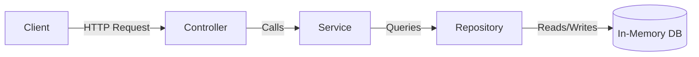

# 03 - Layered Architecture (Controller - Service - Repository)

This module demonstrates the **Controller &ndash; Service &ndash; Repository (CSR)** design pattern using plain Java and manual constructor injection.

## Why Layered Architecture?
- **Separation of Concerns**:
  - **Controller**: Handles incoming requests and orchestrates responses.
  - **Service**: Executes domain logic, business rules, and transactions.
  - **Repository**: Manages data persistence and retrieval.
- **Testability & Maintainability**: Layers can be unit-tested independently by mocking their dependencies.



## How to Run
```bash
mvn clean compile exec:java -Dexec.mainClass="com.swayam.layered.Application"
```
Or run tests:
```bash
mvn clean test
```
