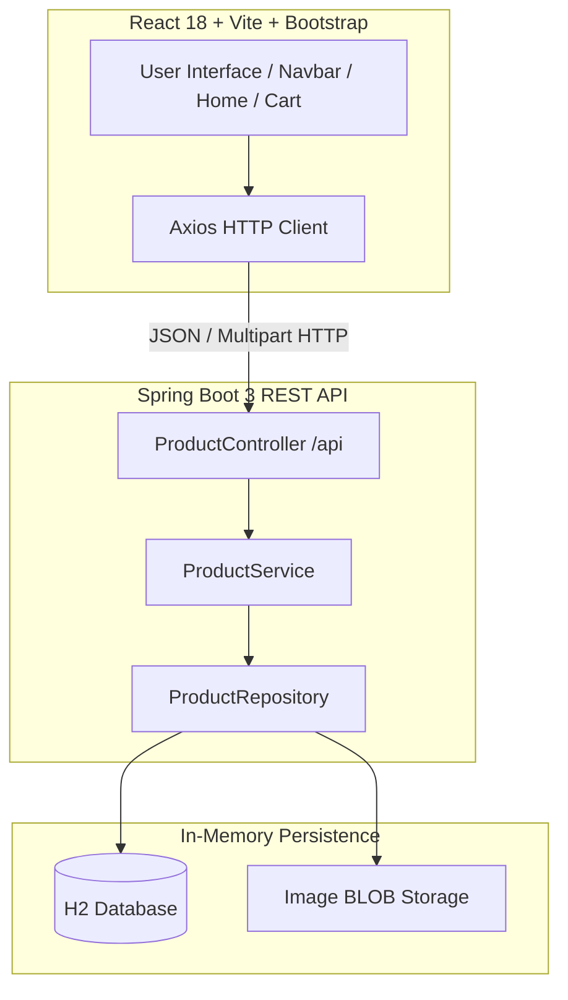

# 05 - Full-Stack E-Commerce Capstone Project

This project serves as the capstone showcase of the Spring Boot learning journey, combining a robust Spring Boot 3 REST API backend with a dynamic React single-page frontend.

## Architecture



## Sub-Directories
- **[`backend/`](backend/)**: Spring Boot 3, Spring Data JPA, H2 Database, Multipart File Upload, JPQL Search.
- **[`frontend/`](frontend/)**: React 18, Vite, Bootstrap 5, Dark Mode, Cart State Management.

## Quick Start

### 1. Launch Backend (Terminal 1)
```bash
cd backend
./mvnw spring-boot:run
```

### 2. Launch Frontend (Terminal 2)
```bash
cd frontend
npm install
npm run dev
```
Open `http://localhost:5173` in your browser.
