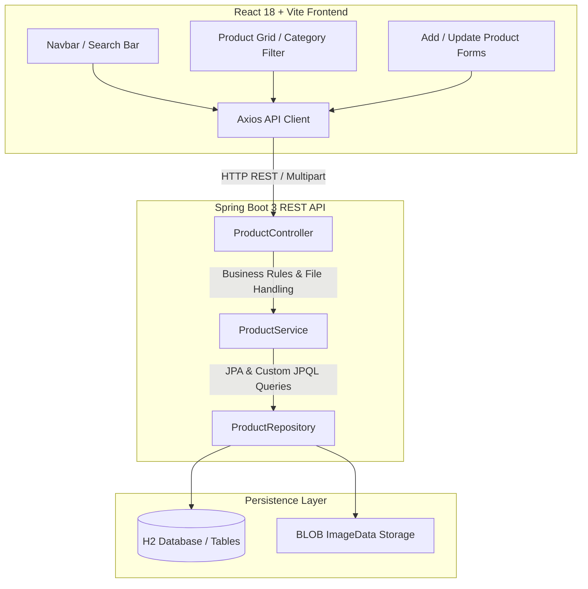

# 🚀 Spring Boot Learning Journey & Full-Stack Showcase

[](https://www.oracle.com/java/)
[](https://spring.io/projects/spring-boot)
[](https://spring.io/projects/spring-data-jpa)
[](https://hibernate.org/)
[](https://www.h2database.com/)
[](https://react.dev/)

Welcome to my **Spring Boot Learning Journey**! This repository documents my step-by-step progression from core Java Dependency Injection (DI) and Inversion of Control (IoC) fundamentals to building full-featured Spring Boot REST APIs and a full-stack e-commerce web application.

---

## 📌 Learning Progression & Repository Structure

The repository is organized chronologically to demonstrate how each concept builds on the previous one:

```text
springboot-learning-journey/
├── 01-basics/                          # Spring Boot quickstart, @SpringBootApplication, embedded Tomcat
├── 02-spring-vs-springboot/
│   ├── spring-core-xml/                # Classic Spring Framework with XML configuration (spring.xml)
│   └── springboot-di/                  # Spring Boot annotation DI (@Component, @Autowired, @Qualifier, @Primary)
├── 03-layered-architecture/            # Controller-Service-Repository design pattern with pure Java DI
├── 04-crud-with-jpa-h2/                # Spring Boot REST API with Spring Data JPA & H2 in-memory database
├── 05-ecommerce-fullstack-project/     # Capstone Full-Stack E-Commerce Application
│   ├── backend/                        # Spring Boot 3 REST API + JPA + Multipart Image Upload + JPQL Search
│   └── frontend/                       # React 18 + Vite + Bootstrap 5 + Axios single-page client
└── Notes/                              # Comprehensive study notes and personal reflections
    ├── 01.md                           # Dependency Injection & IoC
    ├── 02.md                           # Spring vs Spring Boot
    ├── 03.md                           # Layered Architecture
    └── 04.md                           # Spring Data JPA & H2
```

---

## 🧭 Milestone Summary

| Milestone | Directory | Core Concepts & Annotations |
|---|---|---|
| **01. Spring Boot Basics** | [`01-basics/`](01-basics/) | `@SpringBootApplication`, `@RestController`, `@GetMapping`, Embedded Tomcat |
| **02. Spring vs Spring Boot** | [`02-spring-vs-springboot/`](02-spring-vs-springboot/) | XML Configuration vs Annotations, `ApplicationContext`, `@Component`, `@Autowired`, `@Primary`, `@Qualifier` |
| **03. Layered Architecture** | [`03-layered-architecture/`](03-layered-architecture/) | Controller &ndash; Service &ndash; Repository (CSR) pattern, manual Dependency Injection, Separation of Concerns |
| **04. CRUD with JPA & H2** | [`04-crud-with-jpa-h2/`](04-crud-with-jpa-h2/) | Spring Data JPA, `JpaRepository<T, ID>`, `@Entity`, `@Id`, H2 In-Memory DB, RESTful status codes (`200`, `201`, `204`, `404`) |
| **05. Capstone Project** | [`05-ecommerce-fullstack-project/`](05-ecommerce-fullstack-project/) | Multipart Image Handling (`@Lob BLOB`), Custom JPQL Multi-Field Search, CORS, React Frontend Integration |

---

## 🌟 Featured Project: Full-Stack E-Commerce Application

The capstone project is an end-to-end e-commerce store with real-time product management, dynamic category browsing, multi-field search auto-complete, and binary image uploads.

### Architecture Workflow



### Capstone Highlights
- **Binary Image Upload & Streaming**: Upload product photos via `multipart/form-data` and stream binary bytes (`image/jpeg`, `image/png`) directly from H2 BLOB storage.
- **Dynamic Multi-Field Search**: Real-time searching querying across product name, description, brand, and category using custom JPQL.
- **Interactive Shopping Cart**: Client-side state persistence in `localStorage` with real-time stock management and total calculations.

---

## 🛠️ Tech Stack & Tools

- **Backend:** Java 21, Spring Boot 3, Spring Data JPA, Hibernate ORM, H2 In-Memory Database, Lombok, Maven
- **Frontend:** React 18, Vite, Bootstrap 5, Axios, React Router 6, React Icons
- **Testing & Tooling:** JUnit 5, Postman, Git

---

## ⚡ Quick Start: Running the Capstone Project

### 1. Launch Backend API
```bash
cd 05-ecommerce-fullstack-project/backend
./mvnw spring-boot:run
```
*Backend runs on `http://localhost:8080` (H2 Web Console available at `http://localhost:8080/h2-console`).*

### 2. Launch Frontend Client
```bash
cd 05-ecommerce-fullstack-project/frontend
npm install
npm run dev
```
*Frontend runs on `http://localhost:5173`.*

---

## 📚 Study Notes
Detailed concept summaries written during the learning journey:
- 📖 [01. Dependency Injection (DI) & Inversion of Control (IoC)](Notes/01.md)
- 📖 [02. Spring Framework vs Spring Boot](Notes/02.md)
- 📖 [03. Layered Architecture (CSR Pattern)](Notes/03.md)
- 📖 [04. CRUD Operations & Spring Data JPA with H2](Notes/04.md)

---

## 🗺️ Next Steps on the Learning Roadmap
- [ ] **Spring Security 6**: Implement JWT token authentication and role-based access control (RBAC).
- [ ] **Persistent Databases**: Containerize PostgreSQL / MySQL via Docker Compose.
- [ ] **Automated Testing**: Comprehensive Mockito unit tests and `@WebMvcTest` slice tests.
- [ ] **Microservices**: Explore Spring Cloud, API Gateway, and Kafka message streaming.

---

## 👤 Author
- **Swayam Khairnar** &mdash; *Aspiring Backend / Java Developer*
